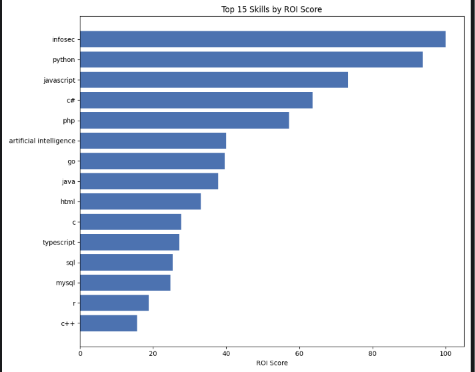

# Data Extraction — Skill ROI Pipeline

A pipeline that collects, cleans, and analyzes data about "skills" (technologies/abilities) from multiple public sources (RemoteOK, GitHub, StackOverflow, Google Trends, Google Search), in order to calculate a **ROI (Return on Investment)** score for each skill — i.e. how much demand it has in the market compared to the cost/time required to learn it.

The final output is a report that helps with decision-making: *which skills are worth investing time in learning*, based on real market data instead of assumptions.

## Architecture

The pipeline follows a linear flow, split into independent modules:

```
┌─────────────┐     ┌───────────────┐     ┌─────────┐     ┌──────────┐     ┌────────┐
│  Extractors │ --> │ Transformers  │ --> │ Storage │ --> │ Analysis │ --> │ Report │
└─────────────┘     └───────────────┘     └─────────┘     └──────────┘     └────────┘
  (fetch raw          (normalize &          (SQLite:         (calculate         (final
   data from           clean skill           raw_staging +    ROI score)         output)
   sources)            names)                pipeline.db)
```

- **Extractors** — connect to external sources (APIs, web scraping) and pull raw data
- **Transformers** — normalize skill names and clean up unusable/duplicate data
- **Storage** — persist raw data (staging) and processed data (pipeline) in SQLite
- **Analysis** — calculate the ROI score for each skill and generate reports
- **Pipeline (orchestrator)** — coordinates the execution order of all the steps above

## Project Structure

```
data-extraction/
├── config/          # Configuration (settings, env vars)
├── extractors/       # Data extraction from external sources
├── transformers/      # Data normalization and cleaning
├── storage/           # Database models and persistence logic
├── analysis/           # ROI calculation and report generation
├── pipeline/            # Orchestration of the whole process
├── tests/                # Unit tests for each module
├── docs/                  # Additional documentation (architecture decisions)
├── data/                   # SQLite databases (auto-generated, not in git)
├── logs/                    # Log files (auto-generated, not in git)
└── main.py                   # Application entry point
```

## Installation

### 1. Clone the repository

```bash
git clone https://github.com/Almirhb/data-extraction.git
cd data-extraction
```

### 2. Create and activate a virtual environment

```bash
python -m venv .venv

# Windows
.venv\Scripts\activate

# macOS/Linux
source .venv/bin/activate
```

### 3. Install dependencies

```bash
pip install -r requirements.txt
```

### 4. Configure environment variables

Copy `.env.example` to `.env` and fill in the required values (API keys, etc.):

```bash
cp .env.example .env
```

Then open `.env` and enter the real values.

## Usage

Run the full pipeline:

```bash
python main.py
```

This will:
1. Extract data from all configured sources
2. Normalize and clean the data
3. Calculate the ROI score for each skill
4. Generate the final report

## Testing

```bash
pytest tests/
```
## Example Output


## Architecture Decisions

For the reasoning behind key technical choices (e.g. why SQLite, why this extraction strategy), see `docs/architecture-decisions/`.

## License

MIT